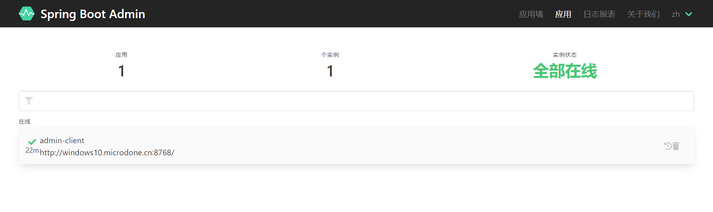
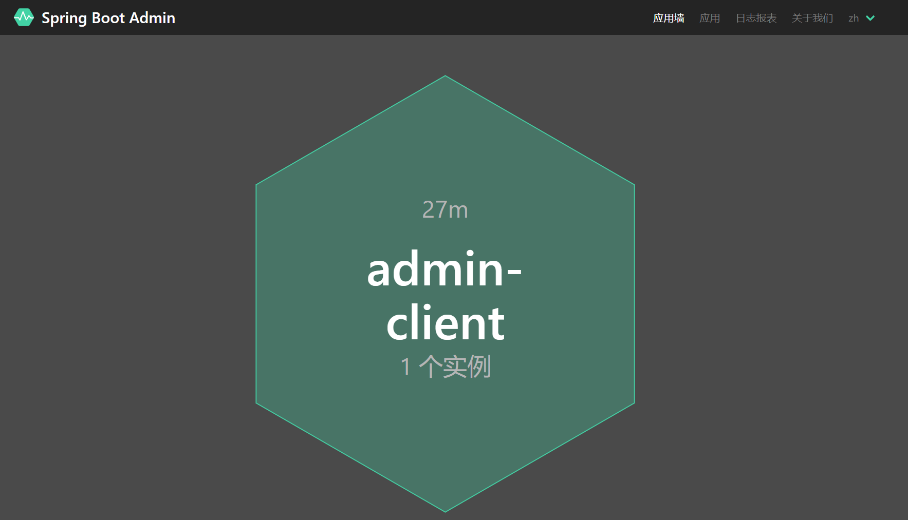
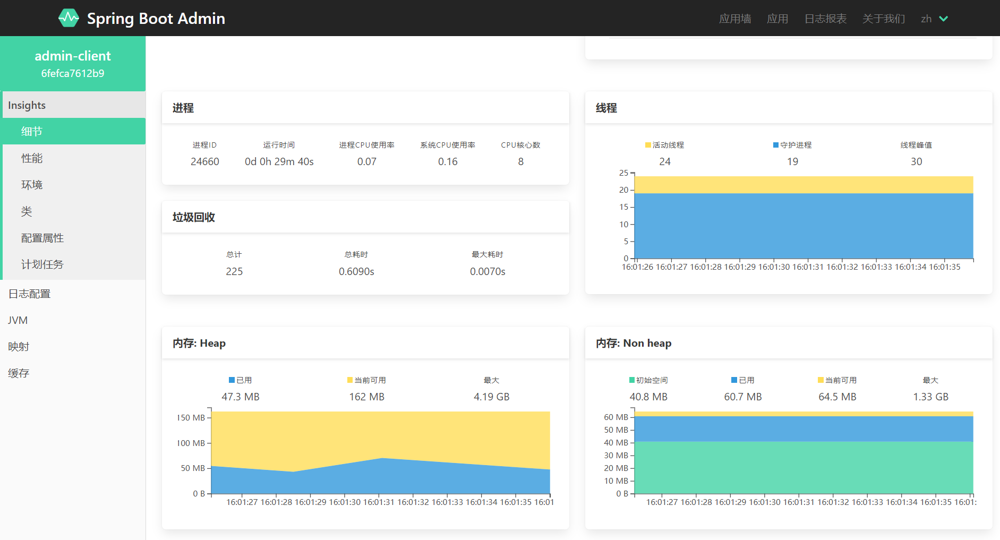

# spring-boot-admi简介
Spring Boot Admin是一个开源社区项目，用于管理和监控SpringBoot应用程序。 应用程序作为Spring Boot Admin Client向为
Spring Boot Admin Server注册（通过HTTP）或使用SpringCloud注册中心（例如Eureka，Consul）发现。 UI是的AngularJs应用程
序，展示Spring Boot Admin Client的Actuator端点上的一些监控。常见的功能或者监控如下：
- 显示健康状态
- 显示详细信息，例如
&emsp;1.JVM和内存指标
&emsp;2.micrometer.io指标
&emsp;3.数据源指标
&emsp;4.缓存指标
- 显示构建信息编号
- 关注并下载日志文件
- 查看jvm系统和环境属性
- 查看Spring Boot配置属性
- 支持Spring Cloud的postable / env-和/ refresh-endpoint
- 轻松的日志级管理
- 与JMX-beans交互
- 查看线程转储
- 查看http跟踪
- 查看auditevents
- 查看http-endpoints
- 查看计划任务
- 查看和删除活动会话（使用spring-session）
- 查看Flyway / Liquibase数据库迁移
- 下载heapdump
- 状态变更通知（通过电子邮件，Slack，Hipchat，…）
- 状态更改的事件日志（非持久性）

# 快速开始
## 创建 Spring Boot Admin Server
本文的所有工程的Spring Boot版本为2.1.0 、Spring Cloud版本为Finchley.SR2。案例采用Maven多module形式，父pom文件引入以下的依赖（完整的依赖见源码）：
```yaml
<parent>
    <groupId>org.springframework.boot</groupId>
    <artifactId>spring-boot-starter-parent</artifactId>
    <version>2.2.5.RELEASE</version>
    <relativePath/>
</parent>

 <dependencyManagement>
    <dependencies>
        <dependency>
            <groupId>org.springframework.cloud</groupId>
            <artifactId>spring-cloud-dependencies</artifactId>
            <version>${spring-cloud.version}</version>
            <type>pom</type>
            <scope>import</scope>
        </dependency>
    </dependencies>
</dependencyManagement>

<spring-cloud.version>Finchley.SR2</spring-cloud.version>
```
在工程admin-server引入admin-server的起来依赖和web的起步依赖，代码如下：
```yaml
<dependency>
    <groupId>de.codecentric</groupId>
    <artifactId>spring-boot-admin-starter-server</artifactId>
    <version>2.2.2</version>
</dependency>
<dependency>
    <groupId>org.springframework.boot</groupId>
    <artifactId>spring-boot-starter-web</artifactId>
</dependency>
```
然后在工程的启动类AdminServerApplication加上@EnableAdminServer注解，开启AdminServer的功能，代码如下：
```java
@EnableAdminServer
@SpringBootApplication
public class SpringBootAdminServerApplication {

    public static void main(String[] args) {
        SpringApplication.run(SpringBootAdminServerApplication.class, args);
    }

}
```
在工程的配置文件application.yml中配置程序名和程序的端口，代码如下：
```yaml
server:
  port: 8769
spring:
  application:
    name: admin-server
```

# 创建Spring Boot Admin Client
在admin-client工程的pom文件引入admin-client的起步依赖和web的起步依赖，代码如下：
```yaml
<dependency>
    <groupId>de.codecentric</groupId>
    <artifactId>spring-boot-admin-starter-client</artifactId>
    <version>2.2.2</version>
</dependency>

<dependency>
    <groupId>org.springframework.boot</groupId>
    <artifactId>spring-boot-starter-web</artifactId>
</dependency>
```
在工程的配置文件application.yml中配置应用名和端口信息，以及向admin-server注册的地址为http://localhost:8769，最后暴露自己的actuator的所有端口信息，具体配置如下：
```yaml
server:
  port: 8768

spring:
  application:
    name: admin-client

  boot:
    admin:
      client:
        # Spring Boot Admin 服务端地址
        url: http://localhost:8769
        instance:
          metadata:
            user.name: ${spring.security.user.name}
            user.password: ${spring.security.user.password}

  security:
    user:
      name: sean
      password: 123456

management:
  endpoint:
    health:
      # 端点健康情况，默认值"never"，设置为"always"可以显示硬盘使用情况和线程情况
      show-details: always
  endpoints:
    web:
      exposure:
        # 设置端点暴露的哪些内容，默认["health","info"]，设置"*"代表暴露所有可访问的端点
        include: "*"
```
在工程的启动文件如下：
```java
@SpringBootApplication
public class SpringBootAdminClientApplication {

    public static void main(String[] args) {
        SpringApplication.run(SpringBootAdminClientApplication.class, args);
    }

}
```

# 启动项目
启动两个工程，在浏览器上输入localhost:8769 ，浏览器显示的界面如下：

查看wallboard,访问地址：http://localhost:8769/wallboard

点击wallboard，可以查看admin-client具体的信息，比如内存状态信息：


# Spring boot Admin结合SC注册中心使用
# 搭建注册中心
注册中心使用Eureka、使用Consul也是可以的，在eureka-server工程中的pom文件中引入：
```xml
<dependency>
    <groupId>org.springframework.cloud</groupId>
    <artifactId>spring-cloud-starter-netflix-eureka-server</artifactId>
</dependency>
```
配置eureka-server的端口信息，以及defaultZone和防止自注册。最后系统暴露eureka-server的actuator的所有端口。
```yaml
eureka:
  client:
    service-url:
      defaultZone: http://localhost:8761/eureka
    register-with-eureka: false
    fetch-registry: false
```
参考：https://blog.csdn.net/forezp/article/details/86105850